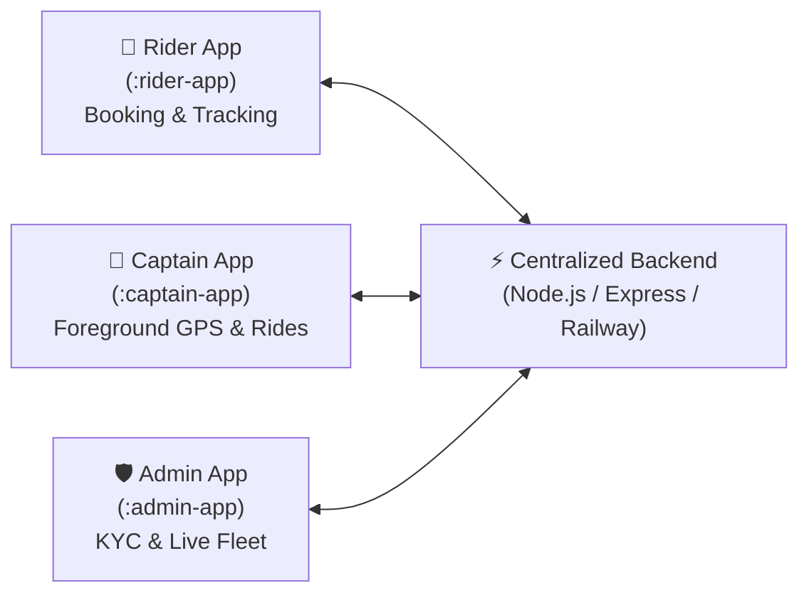

# Speedo — Native Android Ride-Hailing Platform (Rapido-Style)

A complete, full-stack ride-hailing platform built as **three separate native Android applications** (three separate APKs) powered by **Kotlin**, **Jetpack Compose**, and **Material 3**, all connected in real time to **one centralized Node.js/TypeScript backend** and database deployed on Railway.

---

## 📱 Three Native Android Apps



1. **Rider App (`:rider-app`)**
   - Email/password signup & login (JWT auth).
   - Home screen with **osmdroid + CARTO Voyager** map, live GPS pin, and vehicle selector (Speedo Bike, Auto, Cab) with live calculated fares and ETA.
   - Live nearby available captains on map (polled every few seconds).
   - Real-time ride status lifecycle tracking (`requested` $\rightarrow$ `accepted` $\rightarrow$ `arrived` $\rightarrow$ `ongoing` $\rightarrow$ `completed`).
   - Dynamic ETA recalculation and live captain marker movement.
   - 4-digit Ride Verification OTP display.
   - Trip history cached in Room + unread notification badges.

2. **Captain App (`:captain-app`)**
   - KYC submission flow for Vehicle Registration, Aadhaar ID, Camera Live Selfie (`TakePicture` contract), and UPI Payment QR code.
   - KYC Verification Status screen with real-time feedback and Admin remarks.
   - Online / Offline duty toggle (strictly guarded by KYC approval).
   - **Foreground Location Service** (`CaptainLocationService`) with persistent status notification broadcasting GPS lat/lng every 5 seconds to backend.
   - Incoming ride request alert card with loud local notifications and accept/reject timer.
   - Active ride screen with osmdroid navigation, pickup/drop pins, route polyline, and status actions ("Reached Pickup", "Start Ride with OTP", "Complete Ride").
   - Daily earnings dashboard and personal UPI Payment QR code display for passenger payments.

3. **Admin App (`:admin-app`)**
   - Admin secure portal login.
   - Real-time analytics dashboard (Total riders, captains, online fleet, active rides, pending KYC, total revenue).
   - **KYC Review Queue** — Full-size image inspector for Vehicle Reg, Aadhaar, Selfie, and Payment QR images with Approve / Reject actions and Admin remarks.
   - **Live Fleet & Rides Map** — Real-time osmdroid map showing all online captains and active rides across the city.
   - Ride monitoring list with status filters (`requested`, `accepted`, `ongoing`, `completed`, `cancelled`).
   - Customer and driver account moderation (Suspend / Activate).

---

## 🛠️ Architecture & Tech Stack

| Layer | Technologies Used |
| :--- | :--- |
| **Android UI** | Kotlin, Jetpack Compose, Material 3 Custom Theme (Light Orange `#FF6600` & White) |
| **Android Architecture** | MVVM + Repository Pattern, Flow, StateFlow, Coroutines |
| **Shared Android Core** | `:core` module for models, Retrofit, Room DB, osmdroid, Theme, WorkManager |
| **Local Offline Cache** | Room Database (`SpeedoDatabase`, DAOs, Entities) |
| **Background Scheduling** | WorkManager (`NotificationPollingWorker`), Android ForegroundService |
| **Mapping & Geo** | `osmdroid` native library + CARTO tile templates (Voyager/Positron), custom vector markers |
| **Backend REST API** | Node.js, Express, TypeScript, Multer, JWT, Bcrypt |
| **Centralized Database** | PostgreSQL on Railway (with automatic SQLite `speedo.db` fallback for zero-setup local dev) |
| **Deployment** | Railway-ready (`railway.json`, `Procfile`, `Dockerfile`) |

---

## ⚡ Quick Start Guide

### 1. Run Backend Server
```bash
cd backend
npm install
npm run db:migrate
npm run db:seed
npm run dev
```
*The backend will run on `http://localhost:5000` with pre-seeded accounts.*

To run the full automated backend test suite:
```bash
npm test
```

### 2. Run Android Apps in Android Studio
1. Open Android Studio $\rightarrow$ Open `d:/speedo/android`.
2. Select the desired module to build and run:
   - **`rider-app`** $\rightarrow$ Customer booking app
   - **`captain-app`** $\rightarrow$ Driver ride-fulfillment app
   - **`admin-app`** $\rightarrow$ Platform operator & KYC app

---

## 🔑 Pre-Configured Test Logins

| Role | Email | Password | Role Description |
| :--- | :--- | :--- | :--- |
| **Admin** | `admin@speedo.com` | `Admin@123` | Platform Super Admin (KYC review, Live Map) |
| **Captain (Online)** | `captain@speedo.com` | `Captain@123` | Approved KYC, Bike Captain |
| **Captain (Pending)** | `pending_captain@speedo.com` | `Captain@123` | Auto Driver with submitted documents |
| **Rider** | `rider@speedo.com` | `Rider@123` | Passenger customer |
